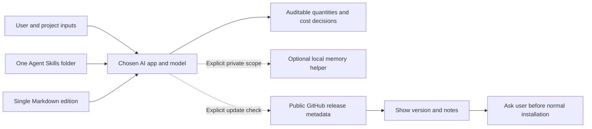

# A small architecture for a universal skill

The system has three parts: portable task instructions, optional local helpers, and versioned distribution. It does not need an application server, database, MCP server or provider SDK.

## Workflow responsibilities

The skill routes tasks to measurement/estimating, drawing-set review, commercial control, lifecycle analysis and evidence-handling references. Templates define optional columns; the host reads inputs, performs calculations and creates outputs. The [feature guide](FEATURES.md) maps each workflow to its inputs and deliverables. No background document processor or finance-system integration is bundled.

## One source of truth

`skills/quantity-surveyor/` is the canonical distributable. `SKILL.md` routes to focused references so capable hosts can load only what they need. A deterministic build concatenates the same guidance into a chat attachment; there is no second hand-maintained model edition. Templates are original CSV/Markdown, with an optional blank XLSX estimating workbook in the pending 2.1.0 source. Memory and update checks are independent optional standard-library scripts.

## Release boundary

A stable semantic version lives in `version.json` and SKILL metadata. A Git tag identifies the source; a GitHub release provides a single-folder install ZIP, the generated Markdown edition and checksums. The ZIP excludes evaluation answers, development logs, documentation artwork and private state. The public repository carries documentation and synthetic evaluation evidence separately.

## Updates

The checker reads only the public [GitHub latest stable release API](https://docs.github.com/en/rest/releases/releases#get-the-latest-release) and compares stable numeric versions. It returns structured status and a validated repository release URL. It never installs anything. A host can trigger it on explicit request or a privately recorded opt-in check-on-use preference. At most weekly successful checks are a host responsibility, with manual Releases/Watch as the capability-neutral fallback. This avoids a background process and gives the user control over behavioral instruction changes.

## Private state

Memory roots and update preferences are user-owned, outside the installed skill. Memory records have an explicit user/project scope, evidence status and correction chain. The helper requires all scope arguments, uses atomic replacement and a previous-copy backup, and refuses ambiguous missing-primary states. These mechanisms prevent accidental scope mixing; filesystem access controls protect confidentiality. No remote sync is provided.

## Maintainer checks

The local validation command checks format, local links, canonical version, sealed evaluation hashes and generated distribution consistency. Executed tests cover the memory helper and update parsing/failure behavior. CI repeats deterministic checks without live market requests, model calls or secrets. Behavioral changes need fresh frozen evaluation evidence with its scope and limits stated; passing packaging tests does not establish estimating competence. See [evaluation methodology](EVALUATION.md).

## Large sets without a new platform

The host can maintain drawing and quantity registers as plain tables, use its existing visual/PDF tools and checkpoint batches. The skill specifies the evidence contract, not a parser implementation. Additional databases or remote drawing services remain optional host choices. The generated complete edition also supplies llms-full.txt; llms.txt is a small curated discovery index.
